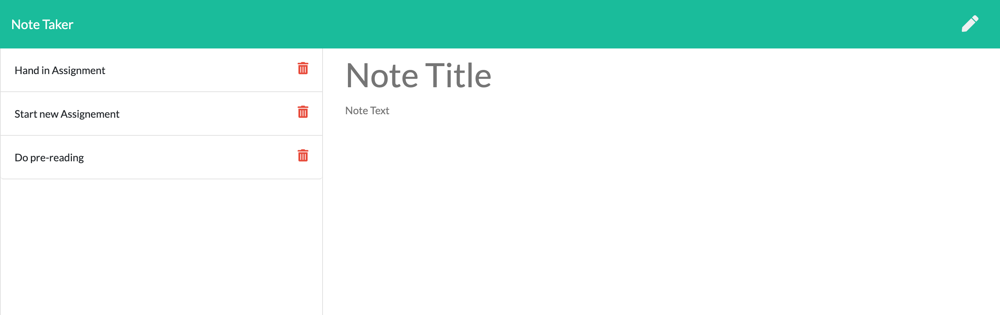

# Express.js: Note Taker

## Description 

This application called Note Taker can be used to write and save notes. This application uses an Express.js back end and saves and retrieve note data from a JSON file.

When the application is first opened the user sis presented with a landing page with a link to a notes page. When the link is clicked on a new page is presented with existing notes on the left hand column and an empty field to create new notes on the righ hand column. 

When a new note is entered into the text area, a save button appears. Once that save button is clicked the note is created and appears on the left hand column with the rest of the notes.

 The following technologies were used to create this application
  - Express.JS
  - Javascript
  - Heroku

Preview of final product 

Live demonstration of the application can be found at https://guarded-temple-55964.herokuapp.com/

 ## Table of Contents 
  
  - [Installation](#installation)
  - [Usage](#usage)
  - [License](#license)

  - [Resources](#resources)
  - [Questions](#questions)

 ## Installation 
  To install the application clone the repository from GitHub. Ensure you have the necessary dependencies of Inquirer and Jest installed. To do so, invoke the command `npm install` in your terminal.

  You must also have Node.JS installed.

## Usage 

  To run the application in your terminal invoke the command ``npm start``

  ## License 
  [MIT](https://choosealicense.com/licenses/mit/)

  Copyright (c) 2021 Elise Harman

   ## Resources

  [Espress.JS Static Files](http://expressjs.com/en/starter/static-files.html)

  [fs.readFile](https://stackabuse.com/read-files-with-node-js/)

  [Heroku](https://devcenter.heroku.com/articles/deploying-nodejs)
  
  
  ## Questions 
  If you have any questions or would like to report and issue please contact me at my [GitHub]( https://github.com/harmane4) or elise_harman@hotmail.com   
